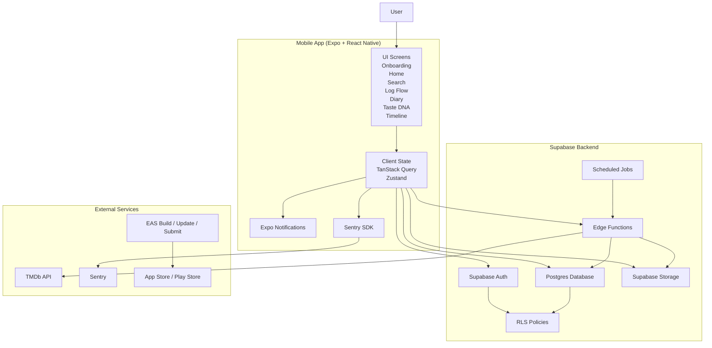
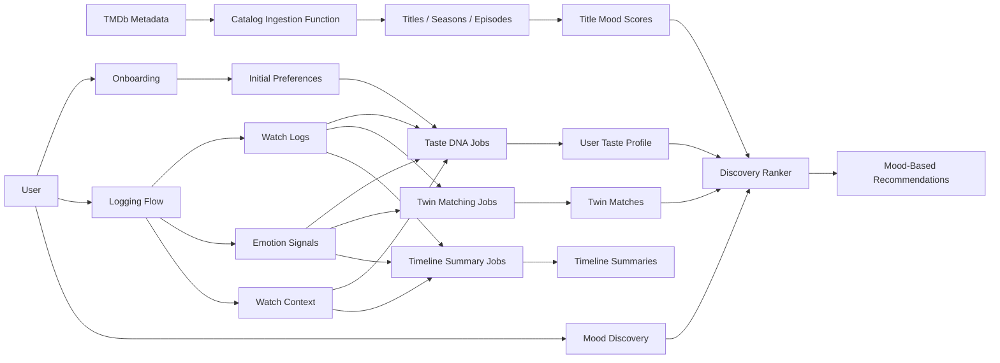
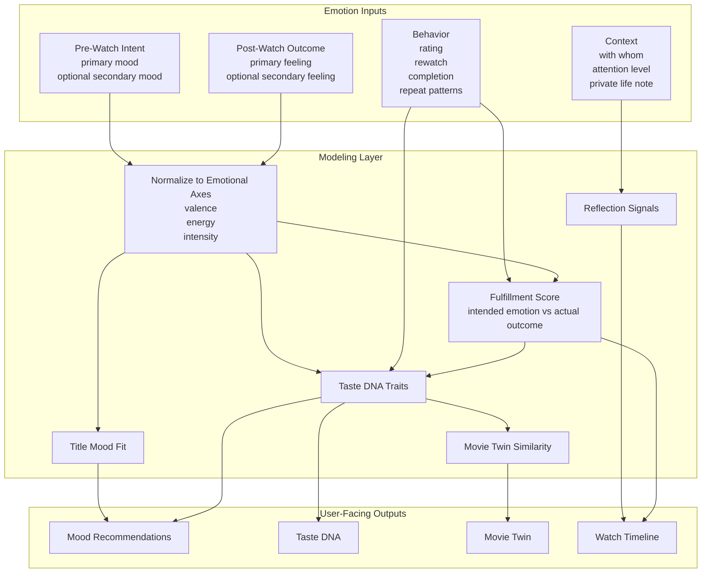
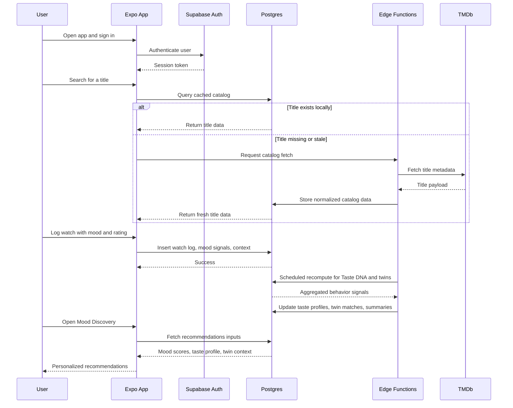
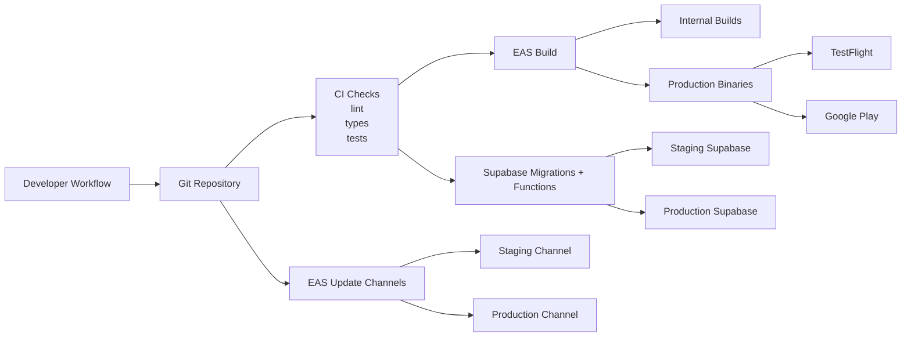

# WatchYourself Architecture Diagrams

This document visualizes the mobile, backend, and mood-intelligence architecture for WatchYourself.

## 1. System Architecture

## 2. Core Product Data Flow

## 3. Mood Intelligence Pipeline

## 4. Runtime Request Flow

## 5. Deployment Architecture

## Notes

- The app client should talk directly to Supabase for standard user-scoped operations protected by RLS.
- Edge Functions should handle any privileged workflows, secret-bearing integrations, and scheduled recomputation.
- The emotional modeling layer should be explainable, confidence-based, and resilient to sparse early data.
